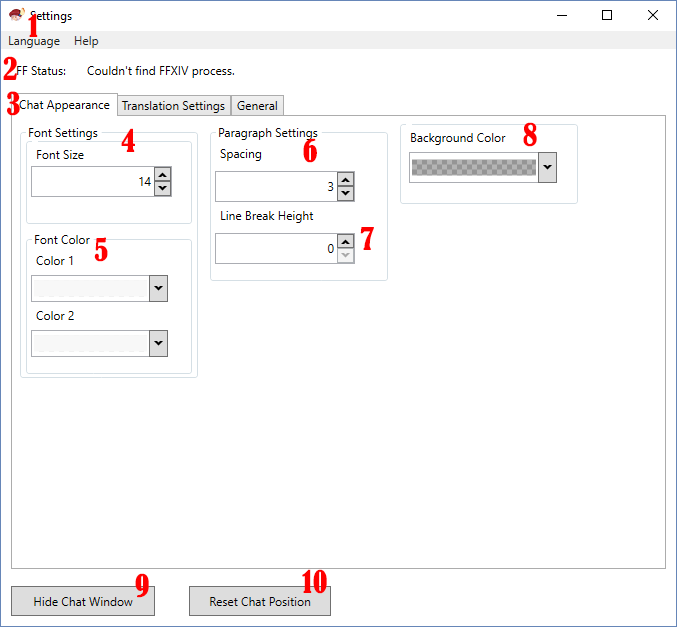
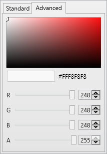

## In depth interface guide
* [Chat Appearance](#chat-appearance)  

###Chat Appearance

1. **Language:** You can choose interface language here. There are two languages for your convenience. You can switch between Russian and English. If you want, you can make your own translation.
2.  **FF Status:** This line shows how well the application works. In good conditions there is a phrase here *Process found*. If you see a phrase *Couldn't find FFXIV process.* make sure that application was launched with administrator rights and you are playing FFXIV with DirectX 11 enabled.
3.  **Chat Appearance** - under this tab you can configure an appearance of the Chat Window. 
4.  **Font Size** - here you can change font size of your translation. That's all.
5.  **Font Color** - you can choose font color here separately. The first replica of a person will be displayed in one color, and the second replica will be displayed in another. This way they will alternate. Or you can use the same color for both of them.  
	 
    * You can configure your color in RGB format.
    * Line *A* will help you to change transparency of your color.

6. Under the **Paragraph Settings** line you can add the required number of spaces at the beginning of each sentence by changing **Spacing** count.
7. **Line Break Height** will increase the distance between the text blocks. It will help you to read more clear.
8. **Background Color** - you can change the background color of you Chat Box. There are a lot of settings with color customization and transparency. Color can be set in RGB or HEX. Parameter A - transparency (under the Advance settings).
9. **Show/Hide Chat Window** - to make sure that you've set up your chat window correctly, you can show or hide it.
10. **Reset Chat Position** - you can reset the position of your Chat Box if you drag it outside the screen.
