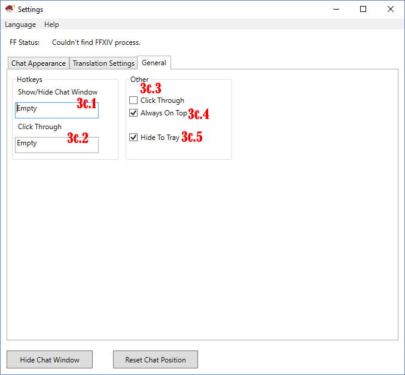

## Подробное руководство по интерфейсу  
* [Настройки внешнего вида](#настройки-внешнего-вида)  
* [Настройки перевода](#настройки-перевода)  
* [Основные настройки](#основные-настройки)  

### Настройки внешнего вида  

1. **Язык:** в данном пункте меню можно изменить язык интерфейса программы. На выбор есть два языка - Русский и Английский. Если вам очень хочется, вы можете перевести приложение на свой собственный язык.
2.  **FF Статус:** данная строка показывает подключилось ли приложение к игре. Если всё хорошо, то вы увидите надпись *Процесс найден*. Если высвечивается сообщение *Не удалось найти процесс FFXIV*, нужно проверить, запускается ли приложение от имени администратора и выбран ли DirectX 11 в настройках Final Fantasy XIV.
3.  **Настройки внешнего вида:** в данном разделе можно настроить внешний вид окна чата.
4.  **Размер шрифта:** данный пункт меняет размер шрифта. На этом, в принципе, всё. 
5.  **Цвет шрифта:** здесь можно выбрать различный цвет текста, который будет использоваться в окне перевода. Первая реплика будет отображаться одним цветом, а вторая реплика - другим. Таким образом реплики будут чередоваться по цветам. Или же можно выбрать один цвет и весь текст будет одинакового цвета.  
	 
    * Цвета настраиваются в формате RGB.
    * Пункт *A* в дополнительный настройках позволит настроить прозрачность цвета.

6. **Ширина отступа** позволяет настроить ширину отступа в начале каждой новой строчки. Единица равна одному пробелу. 
7. **Межабзацный интервал:** отвечает за расстояние между блоками текста. Это сделает текст более читаемым. 
8. **Цвет фона:** вы можете изменить цвет фона у окна чата. В данном разделе большой выбор по настройке цветов и прозрачности. Цвета настраиваются в формате RGB или HEX. Параметр *A* отвечает за прозрачность фона (в разделе Дополнительно).
9. **Показать/Скрыть окно перевода:** чтобы проверить как вы настроили окно чата, его можно показать или скрыть. 
10. **Сбросить окно:** данная кнопка сбросит положение чата, если вы перетащили его в недоступное место.

### Настройки перевода  

  
1. **Сервис перевода:** здесь меняется сервис перевода. Лично мне нравится больше DeepL, но Google Translate тоже неплохо справляется со своей работой. Попробуйте разные и выберите то, что вам понравится больше. 
2. **Язык игры:** данный пункт должен соответсвовать языку в игре.  
3. **Язык перевода:** выберите тот язык, на котором вам комфортнее всего читать. 

### Основные настройки  

1. **Игнорировать нажатия:** данный пункт позволит игнорировать нажатия по окну чата, чтобы вы случайно не нажимали на него во время игры.
2.  **Поверх всех окон:** стоит включить данный пункт. Таким образом окно чата всегда будет поверх всех окон, чтобы вы всегда могли прочитать переведенный текст. 
3.  **Свернуть в трей:** при сворачивании окна настроек, оно будет попадать в трей. 
4.  **Горячая клавиша Показать/Скрыть окно:** для вызова или скрытия окна чата можно использовать горячие клавиши. Комбинация обязательно должна иметь вид Ctrl/Shift/Alt + Любая клавиша или Ctrl+Shift+Alt + Любая клавиша, и всё в таком духе.
5.  **Горячая клавиша Игнорировать нажатия:** чтобы быстро включить/выключить игнорирование нажатий по окну чата, можно использовать горячую клавишу. Правила для горячих клавиш такие же как и для *Показать/Скрыть окно*. Но сочетание обязательно должно быть другим!
