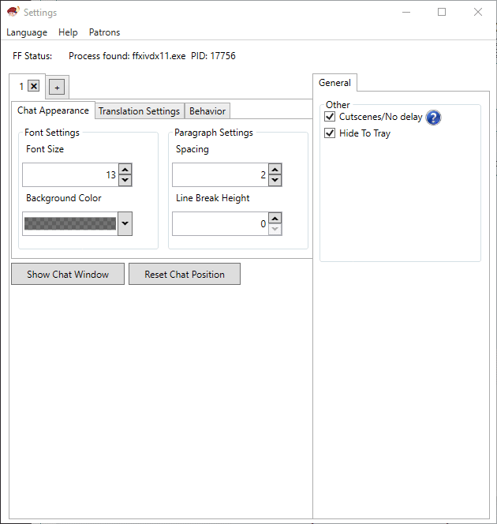
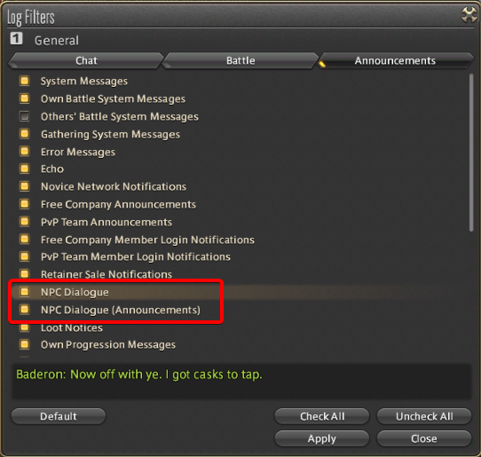

# Tataru Helper

 

## [Download Now](https://github.com/NightlyRevenger/TataruHelper/releases/latest)( \---> Download Setup.exe)

## [Servidor de Discord Tataru](https://discord.gg/bSrpbd9)

* * *

   

## [Demonstración](https://youtu.be/7HiQXzmkQuw)

## [Donaciones](https://github.com/NightlyRevenger/TataruHelper/blob/master/README.md#support)

* * *

## Tabla de Contenidos

* [Español](#Español) 
   * [Instalación](#Instalación)
   * [Instrucciones de uso](#Instrucciones-de-uso)
   * [Desarrollo/traducción](#Desarrollotraducción)
   * [Licencia](#Licencia)
   * [Créditos](#Créditos)
   * [Contactos](#Contactos)
   * [Soporte](#Soporte)

* * *

#### Español

Desarrollado por el equipo de Tataru

Tataru Helper - aplicación para la traducción de textos en Final Fantasy XIV. Algunos ejemplos de textos que se traducen son: Main Story Quest (MSQ - Historia), escenas, Personajes No Controlables (PNC), misiones.

- Puedes elegir el idioma del que traducir y a cual traducir.
- Puedes cambiar el motor del traductor y utilizar varios métodos de traducción. 
- Puedes seleccionar un chat específico para la traducción. 
- Actualizaciones automáticas.
- Tataru Taru!

## Instalación

Tataru Helper requiere:  
Windows 7 **x64** o posterior (sólo sistemas **x64**).  
[Microsoft . NET Framework 4.6.2 ](https://www.microsoft.com/net/download/dotnet-framework-runtime)o superior.  
Final Fantasy XIV con **DirectX 11** y **x64**.

1. Descargar la última versión de la aplicación [aquí](https://github.com/NightlyRevenger/TataruHelper/releases/latest) (Setup.exe).
2. Ejecuta el archivo Setup.exe, si recibe el mensaje de que "Windows quiere proteger su PC", pulsa más información y ejecuta de todos modos. El acceso directo se colocará en el escritorio.
3. Tataru Helper se iniciará automáticamente, configura el idioma de origen/destino y realiza la configuración inicial.
4. Cierra la ventana de configuración y arrastra la ventana flotante, donde aparecerá el chat, a donde quieras.
5. Asegúrate de que los siguientes mensajes están seleccionados en el menú de ajustes del juego:  
6. ¡Todo listo!  
   P.D. Después de eso, no hay necesidad de ejecutar la aplicación a través de Setup.exe. ¡Este es el instalador! El acceso directo para lanzar la aplicación está en el escritorio o en el menú de inicio.

## Instrucciones de uso

- Guía detallada [aquí](./Guide.MD).

## Desarrollo/traducción

¿Quieres contribuir? ¡Genial!

Si deseas traducir la aplicación a tu idioma, entra [aquí](https://crowdin.com/project/tataru-helper).

## Licencia

[MIT](/LICENSE)

## Créditos

Muchas gracias a todos aquellos que contribuyen en proyectos de código abierto. Los siguientes ayudaron a crear esta aplicación:  
[WPF Toolkit™](https://github.com/xceedsoftware/wpftoolkit)  
[BondTech.HotKeyManagement](https://github.com/bondtech/HotKey-Manager-for-WinForm-and-WPF-Apps)  
[NotifyIcon WPF](https://bitbucket.org/hardcodet/notifyicon-wpf/)  
[Sharlayan](https://github.com/FFXIVAPP/sharlayan)  
[Arte Tataru de Nezusagi](https://www.deviantart.com/nezusagi)  
[Squirrel.Windows](https://github.com/Squirrel/Squirrel.Windows)

## Contactos

Aquí está nuestro servidor de Discord: [click ](https://discord.gg/bSrpbd9)

Si tienes alguna pregunta puedes contactar conmigo en:  
xDarkOne:  
Discord: xDarkOne#6486  
Telegram: [click](https://t.me/xDarkOne)  
VK: [click](https://vk.com/velikov_ra)  
Twitch: [xDark0ne](https://www.twitch.tv/xdark0ne)  
NightlyRevenger(developer):  
[nightlyrevenger@yandex. u](mailto:nightlyrevenger@yandex.ru)

## Soporte

Si quieres apoyar este proyecto, usa los enlaces de abajo:  
MasterCard(Sberbank): 5469 3800 2554 9048  
Yandex. oney: [4100172621059](https://money.yandex.ru/to/4100172621059)  
PayPal: [paypal.me/xdarkone](https://www.paypal.me/xdarkone)  
Patrón: [TataruHelper](https://www.patreon.com/TataruHelper)

* * *
